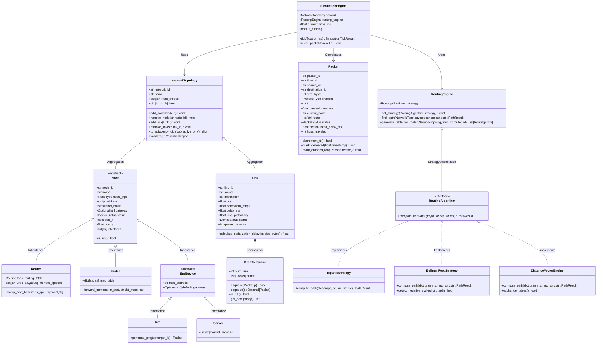

# NetSimX — Class Design Document
**Document ID:** NX-ARCH-008  
**Project:** NetSimX — Intelligent Network Design, Simulation & Performance Analysis System  

---

## 1. Class Diagram Architecture & Relationships

NetSimX uses strict object-oriented modeling with clear inheritance hierarchies for network devices and a Strategy pattern for routing algorithms.

---

## 2. Design Patterns Utilized

1. **Strategy Pattern:** For `RoutingEngine` $\rightarrow$ `RoutingAlgorithm` (`DijkstraStrategy`, `BellmanFordStrategy`). Allows dynamic switching between Link-State and Distance-Vector protocols without modifying simulation code.
2. **Repository Pattern:** `DatabaseRepository` isolates SQL queries behind clean entity interfaces (`NetworkRepository`, `ExperimentRepository`).
3. **Observer / EventBus Pattern:** `EventManager` and `SimulationEngine` publish typed events (`PacketEvent`, `NodeStateEvent`), consumed asynchronously by the GUI and `MetricsEngine`.
4. **Composite / Container Pattern:** `NetworkTopology` safely encapsulates devices and bidirectional links while exposing graph theory views.
