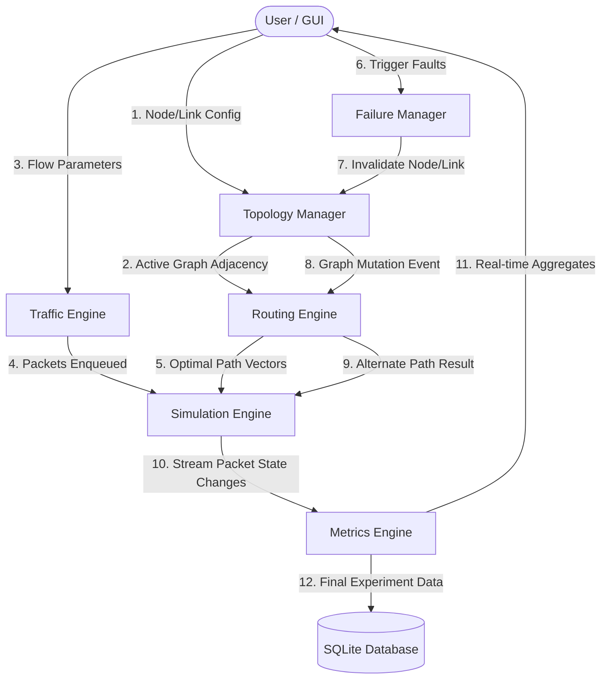
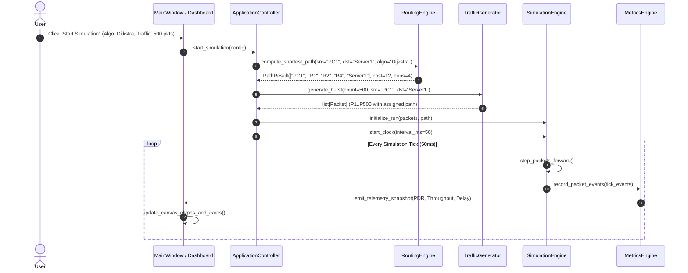
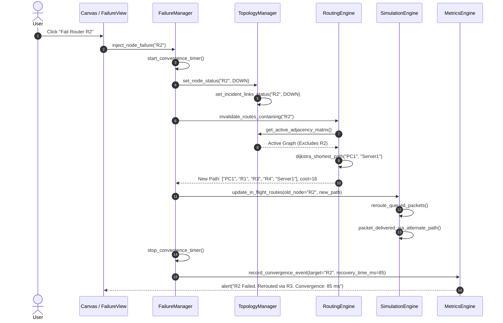

# NetSimX — Data Flow & Sequence Diagrams
**Document ID:** NX-ARCH-009  
**Project:** NetSimX — Intelligent Network Design, Simulation & Performance Analysis System  

---

## 1. Data Flow Diagrams (DFD)

### 1.1 DFD Level 0 (Context Level)

```
                       ┌────────────────────────────────┐
                       │          Student / User        │
                       └───────────────┬────────────────┘
                                       │
                         1. Topology   │  4. Real-time Telemetry,
                            Config &   │     Graphs, Alerts,
                            Commands   │     Comparison Results
                                       ▼
                       ┌────────────────────────────────┐
                       │            NetSimX             │
                       │     Simulation Platform        │
                       └───────┬────────────────┬───────┘
                               │                │
            2. Persist Run     │                │ 3. Read/Write
               & Metrics       ▼                ▼    Topology Files
                       ┌───────────────┐ ┌───────────────┐
                       │    SQLite     │ │  Local File   │
                       │   Database    │ │    System     │
                       └───────────────┘ └───────────────┘
```

### 1.2 DFD Level 1 (Component Data Flow)



---

## 2. Sequence Diagrams

### 2.1 Sequence 1 — Start Simulation Run



### 2.2 Sequence 2 — Router Failure & Route Recalculation



### 2.3 Sequence 3 — Packet Hop-by-Hop Transmission & Congestion Drop

```mermaid
sequenceDiagram
    autonumber
    participant P as Packet (P42)
    participant R1 as Router R1 (Queue)
    participant Link as Link (R1 -> R2)
    participant R2 as Router R2
    participant ME as MetricsEngine

    Note over R1: Packet arrives at R1 egress buffer
    alt Queue Depth < Q_max (50 packets)
        R1->>R1: enqueue(P42)
        Note over R1: Experienced Queuing Delay = D_queue
        R1->>Link: transmit(P42)
        Note over Link: Experienced Serialization + Prop Delay
        Link->>R2: receive(P42)
        Note over R2: TTL decremented to 63
        R2->>ME: emit(FORWARDED, node="R2", latency=18ms)
    else Queue Depth >= Q_max
        R1->>ME: emit(DROPPED_CONGESTION, node="R1")
        Note over P: Packet P42 Destroyed (Drop-Tail Overflow)
    end
```
