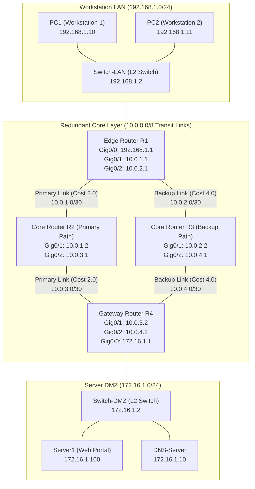

# NETSIMX — Network Topology Specification

**Document ID:** NX-DES-002  
**Author:** Member 1 (Network Architecture, Addressing & Cisco Packet Tracer)  
**Project:** NetSimX — Intelligent Network Design, Simulation & Performance Analysis System  
**Branch:** `arya`  
**Status:** Approved Baseline  

---

## 1. Network Architecture Overview

The NETSIMX campus topology uses a multi-tier hierarchical design comprising an **Access Layer** (Workstation LAN), a **Redundant Core Layer** (Edge & Core Routers), and a **Services/DMZ Layer** (Server Farm).

---

## 2. Device Inventory & Roles

| Device ID | Device Type | Hardware Model | Subnet / IP Address | Role & Justification |
|---|---|---|---|---|
| **PC1** | PC / Workstation | Generic Host | `192.168.1.10/24` | Primary end-user client workstation generating traffic flows to Server1. |
| **PC2** | PC / Workstation | Generic Host | `192.168.1.11/24` | Secondary client workstation for intra-LAN and inter-subnet testing. |
| **Switch-LAN** | L2 Switch | Cisco Catalyst 2960 | `192.168.1.2/24` | Access switch interconnecting Workstations and Edge Router R1. |
| **R1** | Router | Cisco 2911 ISR | `192.168.1.1`, `10.0.1.1`, `10.0.2.1` | Edge router for Workstation LAN; acts as DHCP Server and OSPF ingress. |
| **R2** | Router | Cisco 2911 ISR | `10.0.1.2`, `10.0.3.1` | Primary Core Router offering high-bandwidth/low-cost path (Cost = 2.0). |
| **R3** | Router | Cisco 2911 ISR | `10.0.2.2`, `10.0.4.1` | Secondary/Backup Core Router providing failover path (Cost = 4.0). |
| **R4** | Router | Cisco 2911 ISR | `10.0.3.2`, `10.0.4.2`, `172.16.1.1` | Gateway Router for DMZ Server Farm; OSPF egress to servers. |
| **Switch-DMZ** | L2 Switch | Cisco Catalyst 2960 | `172.16.1.2/24` | DMZ distribution switch connecting Router R4 to enterprise servers. |
| **Server1** | Web Server | Generic Server | `172.16.1.100/24` | Enterprise HTTP Web Portal hosting NetSimX status pages. |
| **DNS-Server** | DNS Server | Generic Server | `172.16.1.10/24` | Name resolution server mapping `netsimx.local` to `172.16.1.100`. |

---

## 3. Physical & Logical Interconnections

| Link ID | Source Device | Source Interface | Destination Device | Destination Interface | Bandwidth | Latency | Metric Cost |
|---|---|---|---|---|---|---|---|
| `L_PC1_SW` | PC1 | FastEthernet0 | Switch-LAN | FastEthernet0/1 | 100 Mbps | 1.0 ms | 1.0 |
| `L_PC2_SW` | PC2 | FastEthernet0 | Switch-LAN | FastEthernet0/2 | 100 Mbps | 1.0 ms | 1.0 |
| `L_SW_R1` | Switch-LAN | FastEthernet0/24 | R1 | GigabitEthernet0/0 | 1000 Mbps | 2.0 ms | 1.0 |
| `L_R1_R2` | R1 | GigabitEthernet0/1 | R2 | GigabitEthernet0/1 | 1000 Mbps | 10.0 ms | 2.0 (Primary) |
| `L_R1_R3` | R1 | GigabitEthernet0/2 | R3 | GigabitEthernet0/1 | 1000 Mbps | 12.0 ms | 4.0 (Backup) |
| `L_R2_R4` | R2 | GigabitEthernet0/2 | R4 | GigabitEthernet0/1 | 1000 Mbps | 10.0 ms | 2.0 (Primary) |
| `L_R3_R4` | R3 | GigabitEthernet0/2 | R4 | GigabitEthernet0/2 | 1000 Mbps | 12.0 ms | 4.0 (Backup) |
| `L_R4_SW` | R4 | GigabitEthernet0/0 | Switch-DMZ | FastEthernet0/24 | 1000 Mbps | 2.0 ms | 1.0 |
| `L_SW_SRV` | Switch-DMZ | FastEthernet0/1 | Server1 | FastEthernet0 | 1000 Mbps | 1.0 ms | 1.0 |
| `L_SW_DNS` | Switch-DMZ | FastEthernet0/2 | DNS-Server | FastEthernet0 | 1000 Mbps | 1.0 ms | 1.0 |

---

## 4. Path Calculation & Routing Topology

### Primary Path (Total Cost = 6.0)
`PC1` $\rightarrow$ `Switch-LAN` $\rightarrow$ `R1` $\rightarrow$ `R2` $\rightarrow$ `R4` $\rightarrow$ `Switch-DMZ` $\rightarrow$ `Server1`
* Cost Breakdown: `1.0 (PC1-R1) + 2.0 (R1-R2) + 2.0 (R2-R4) + 1.0 (R4-Server1) = 6.0`

### Alternate Backup Path (Total Cost = 10.0)
`PC1` $\rightarrow$ `Switch-LAN` $\rightarrow$ `R1` $\rightarrow$ `R3` $\rightarrow$ `R4` $\rightarrow$ `Switch-DMZ` $\rightarrow$ `Server1`
* Cost Breakdown: `1.0 (PC1-R1) + 4.0 (R1-R3) + 4.0 (R3-R4) + 1.0 (R4-Server1) = 10.0`

When `R2` or link `L_R1_R2` fails, OSPF automatically invalidates the primary path and reroutes packets via `R3`.
